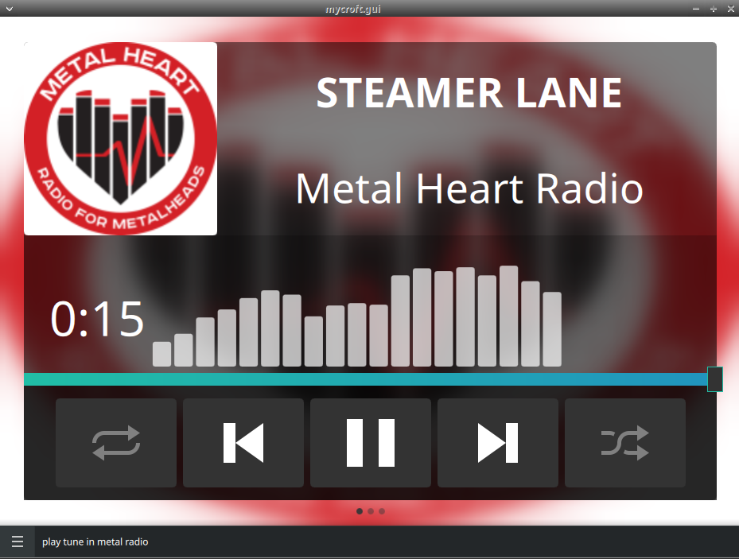

> # ⚠️ DEPRECATED
>
> This OCP **search skill** is deprecated and unmaintained. OCP search skills
> (`OVOSCommonPlaybackSkill` + `@ocp_search`) are replaced by **MediaProvider
> plugins** in the [`ovos-media`](https://github.com/OpenVoiceOS/ovos-media) stack:
>
> - **How MediaProviders work / how to migrate:** https://github.com/OpenVoiceOS/ovos-media/blob/dev/docs/media-providers.md
> - **Base-class deprecation:** [ovos-workshop#423](https://github.com/OpenVoiceOS/ovos-workshop/pull/423)
> - **Replacement:** [`ovos-media-provider-tunein`](https://github.com/OpenVoiceOS/ovos-media-provider-tunein)
>
> This repository will be archived.

#  TuneIn

OCP skill for TuneIn

## Examples 

* "play heavy metal heart radio"
* "play metal heart radio on tune in"

## Credits 
- JarbasAl
- Emphasize

## Category
**Entertainment**

## Tags
#audio 
#music
#OCP
#entertainment
